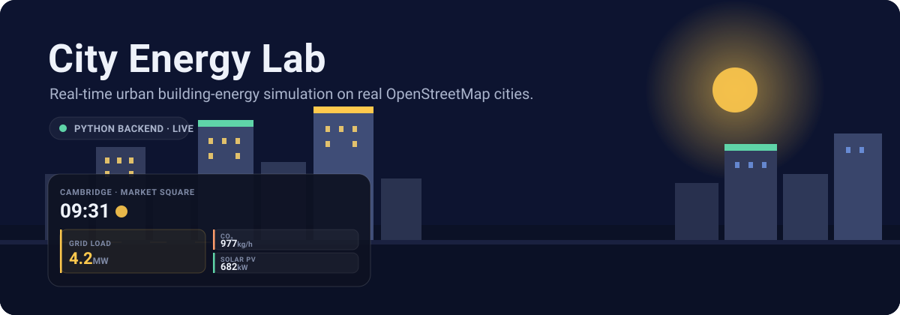
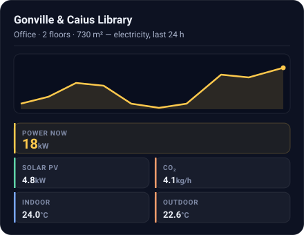
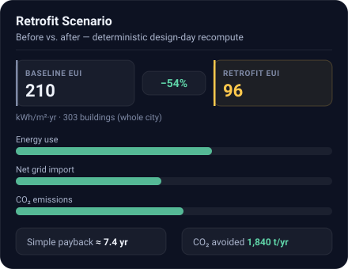
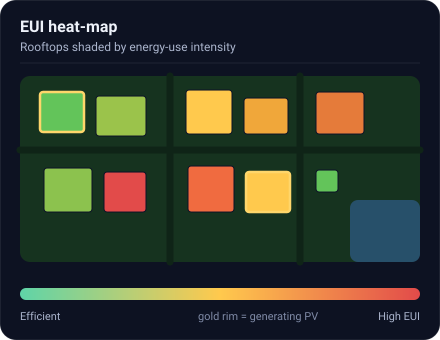
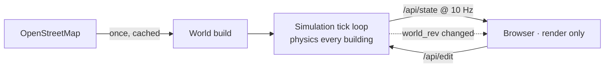

<div align="center">



<h1>⚡ City Energy Lab</h1>

**Real-time urban building-energy simulation on real OpenStreetMap cities.**
Python computes every building's physics each tick — the browser only renders.

[](https://www.python.org/)
[](https://fastapi.tiangolo.com/)
[](docs/architecture.md)
[](https://www.openstreetmap.org/)
[](docs/energy-model.md)
[](LICENSE)

[**Quickstart**](#-quickstart) · [**Documentation**](docs/) · [**Energy model**](docs/energy-model.md) · [**Roadmap**](#-roadmap)

</div>

---

Load any city on Earth by latitude/longitude, watch real building footprints light up with live energy demand, click anything to inspect it, edit the city as it runs, and compare a whole-city retrofit *before vs. after* — all from a tiny, dependency-light Python backend and a zero-build browser front end.

It's a **sandbox**, not a batch tool: the entire city recomputes every tick while you pan, scrub the 24-hour clock, and rebuild streets. The physics is small but honest — a single-node 1C RC thermal model traceable to **ISO 13790 / SIA 2044**.

## ✨ Highlights

- 🗺️ **Real cities** — type a lat/lon and the backend pulls building footprints, streets, parks and water from OpenStreetMap (cached after first load).
- 🧠 **Server-authoritative physics** — a 1C RC thermal node per building (envelope UA, solar gain, internal/HVAC/lighting/appliance loads), rooftop PV, and CO₂, recomputed every tick.
- 🖱️ **Fully interactive** — click buildings/cars/people for live detail, add or bulldoze buildings & roads, change floors, spawn agents, scrub time, all live.
- 📊 **Retrofit scenarios** — drag city-wide measure sliders (insulation, glazing, LED, heat-pump COP, rooftop PV) and see baseline → retrofit EUI, load curves, CO₂ and indicative payback, side by side.
- 🌡️ **EUI heat-map** — recolor rooftops green→red by energy-use intensity; gold rim marks buildings generating solar PV.
- 🏔️ **Terrain & realistic ground (optional)** — real DEM elevation as hillshaded relief that lifts buildings, roads and agents to their true height, or OSM map / satellite imagery warped into the isometric ground, plus level-of-detail tiers. The classic stylized look stays the default.
- 🌦️ **Live weather** — real temperature via the Open-Meteo API; clouds and rain scale solar gain, envelope loss and agent speed.
- 📦 **No build step** — the front end is plain HTML + CSS + native ES modules. No npm, no bundler, no transpile.

## 🖥️ The interface

<table>
  <tr>
    <td width="33%" valign="top">
      <br>
      <sub><b>Building detail</b> — live metric tiles + a 24 h load chart for any building you click.</sub>
    </td>
    <td width="33%" valign="top">
      <br>
      <sub><b>Retrofit scenario</b> — whole-city before vs. after, with energy, CO₂ and payback.</sub>
    </td>
    <td width="33%" valign="top">
      <br>
      <sub><b>EUI heat-map</b> — efficiency at a glance across the whole city.</sub>
    </td>
  </tr>
</table>

## 🏔️ Realistic ground & terrain

Two new HUD rails keep the classic stylized view as the default while adding optional realism:

- **Ground** — `Stylized` (default) · `Hillshade` (slope-shaded real elevation) · `Map` (OpenStreetMap tiles) · `Satellite` (Esri World Imagery), the imagery warped into the isometric ground plane per terrain cell.
- **Display** — `Relief` lifts buildings, roads, cars and people to their true ground height (available in terrain-aware ground modes); `Detail` pins the level-of-detail (`Auto` switches with zoom: far = flat footprints, mid = volumes, near = façades & windows).

Elevation comes from a 33×33 DEM grid fetched once per city (SRTM via the Open-Elevation API, Open-Meteo as fallback) and cached in `backend/data/` beside the OSM cache; tile imagery is fetched by the browser with the required attribution shown on-screen. The grid test world has no geo-reference, so it stays stylized. Everything here is **cosmetic** — the energy model does not read elevation. Choices persist in the browser.

## 🚀 Quickstart

```bash
python -m venv venv && venv\Scripts\activate     # Windows
# python3 -m venv venv && source venv/bin/activate  # macOS / Linux
pip install -r requirements.txt
uvicorn backend.main:app --reload
```

Open **http://localhost:8000** — drag to pan, scroll to zoom, click any building, car or person.

> **No build step.** The browser resolves every `import` directly; nothing is compiled or bundled.

The world is chosen entirely by `input/config.json` (`"world": "map"` for real OSM, `"grid"` for the offline test scene). With `--reload`, editing any `input/*.json` restarts the server automatically. The first map load fetches the OSM area once via the Overpass API and caches it under `backend/data/` — after that it runs offline.

An optional `"locale"` block in `input/config.json` localizes the economics and emissions without touching Python — grid carbon intensity, currency symbol, electricity tariff, and the retrofit cost book:

```json
"locale": {
  "co2_grid_kg_kwh": 0.233,
  "currency": "£",
  "tariff_per_kwh": 0.28,
  "measure_cost_per_m2": { "u_wall": 60.0, "pv_fraction": 250.0 }
}
```

Every key is optional; omitted keys fall back to the UK-flavored defaults documented in [the energy model](docs/energy-model.md) and [retrofit scenarios](docs/retrofit-scenarios.md).

## 🧭 How it works



The Python backend owns **all** state and physics in an `asyncio` tick loop. The browser is a thin render client: it polls `/api/state` ~10×/second, draws the scene to a canvas, and sends edits back. A `world_rev` counter tells the client when the static layout changed so it refetches `/api/world`. Full details in [**Architecture & Data Flow**](docs/architecture.md).

## 🔬 The energy model

Every building is a **single-node 1C RC thermal model** (ISO 13790 / SIA 2044, reduced to one capacitance and one conductance):

```
C · dT_in/dt  =  Q_solar + Q_internal  −  UA · (T_in − T_out)
```

- **UA** — envelope conductance from wall/window/roof/slab U-values and window-to-wall ratio, **plus** ventilation/infiltration air exchange at a per-type air-change rate
- **Q_solar** — window gain weighted by a per-façade orientation factor from the real polygon
- **HVAC** — proportional to `UA × (setpoint − T_in)`, divided by the system COP
- **Lighting** — reduced by a daylight factor (peaks at noon, zero outside 06–18 h)
- **PV** — roof area × usable fraction × panel efficiency × cloud-adjusted irradiance
- **CO₂** — grid electricity × 0.233 kg/kWh

Six building archetypes carry their own standards-based U-values, schedules, densities and setpoints. The full derivation, constant tables, sources, and an honest list of simplifications are in [**The Energy Model**](docs/energy-model.md).

## 🏢 Building types

| Type | Icon | Character |
|---|:---:|---|
| `res` | 🏠 | Residential — evening occupancy peak, moderate loads |
| `office` | 🏢 | Office — business hours, high appliance density |
| `shop` | 🛍️ | Shop — retail hours, high lighting load |
| `hospital` | 🏥 | Hospital — 24/7 baseline, dual peaks at 09:00 & 14:00 |
| `school` | 🏫 | School — empty at night, full 09–15 h |
| `industrial` | 🏭 | Industrial — shift pattern, highest appliance load |

## 🔌 API

| Route | Returns |
|---|---|
| `GET /api/world` | Static layout: building polygons, roads, parks, water (+ `world_rev`) |
| `GET /api/state` | Live snapshot: clock, positions, totals, per-building EUI (+ `world_rev`) |
| `POST /api/edit` | Apply one edit command (bumps `world_rev`) |
| `GET /api/building/{id}` | 24 h load history + current kW, CO₂, PV, indoor temp, occupancy |
| `GET /api/car/{id}` · `GET /api/person/{id}` | Agent telemetry (speed / steps) + distance |
| `POST /api/scenario` | Before/after retrofit comparison — stateless, never touches the live sim |
| `POST /api/load_city` | Rebuild the world for any lat/lon |
| `GET /api/export/buildings.csv` · `POST /api/export/scenario.csv` | Downloadable CSV exports |

Interactive API documentation (Swagger UI) is served at **`/docs`**, and the machine-readable schema at `/openapi.json` — point a client generator at it to script the sim from any language.

## 🖥️ Headless batch mode

Everything the retrofit panel computes is also available **without the server or the browser** — for scripting, CI, or feeding results into GIS tools:

```bash
python -m backend.batch                                  # baseline CSV + GeoJSON
python -m backend.batch --measure u_wall=0.7 --measure cop=1.3 --target-types res
python -m backend.batch --scenario myplan.json --tariff 0.30 --out results/
python -m backend.batch --annual --weather city.epw      # full 8760 h year vs a real TMY
python -m backend.batch --list-measures                  # available measure keys
```

It builds the same world from `input/` (OSM cache included), evaluates every building over the deterministic design day — or a full **8760-hour year** with `--annual`, driven by a standard **EnergyPlus EPW/TMY** weather file (or a clearly-labelled synthetic year without one) — and writes:

| File | Contents |
|---|---|
| `buildings.csv` | Per-building baseline day: energy breakdown, CO₂, PV, peak kW, annualised EUI |
| `buildings.geojson` | Building footprints in **WGS84** with the same metrics as properties — drop straight into QGIS / ArcGIS / kepler.gl |
| `scenario.json` · `scenario_buildings.csv` | Full before/after comparison + per-building rows (when measures are given) |
| `annual_buildings.csv` · `annual_monthly.csv` | Per-building annual kWh by end use, CO₂, peak, EUI + city monthly profile per type (`--annual`) |

A `--scenario` file uses the same JSON body as `POST /api/scenario`; `--measure` / `--target-*` / `--tariff` flags merge over it.

## 🎯 Validation & calibration

Two tools back the numbers with evidence instead of vibes:

- **Archetype benchmark check** — `python -m backend.validate` runs each building type through the annual engine and prints its EUI against published UK stock benchmarks (CIBSE TM46 category medians, heat-pump-equivalent basis), deviations and caveats included. Pass `--weather uk_city.epw` for a like-for-like climate.
- **Per-building overrides** — drop an `input/overrides.csv` (or pass `--overrides`) with measured U-values, setpoints, air-change rates or metered annual kWh per building id; overrides refine the baseline everywhere (design day, scenarios, annual runs), and rows with `measured_kwh_yr` get a model-vs-measured error column plus a calibration summary (mean bias, mean absolute error). See [backend/overrides.py](backend/overrides.py) for the format.

## 📚 Documentation

| Doc | What's inside |
|---|---|
| [Energy Model](docs/energy-model.md) | The 1C RC physics, envelope UA, solar/internal gains, HVAC, PV, CO₂, constants & sources |
| [Architecture & Data Flow](docs/architecture.md) | Server-authoritative design, tick loop, API surface, the no-build frontend |
| [The City & Agent Simulation](docs/simulation.md) | OSM world building, the street-graph random walk, weather, live edits |
| [Retrofit Scenario Analysis](docs/retrofit-scenarios.md) | The design-day before/after method, measures, targeting, cost & payback |
| [Modeling Scope & Limitations](docs/modeling-scope.md) | What's modeled vs. deliberately simplified, and why |

## 🛣️ Roadmap

Directions under consideration — each chosen to fit the real-time sandbox (closed-form, recomputes per tick). See [Modeling Scope](docs/modeling-scope.md).

- [ ] **Per-carrier emissions + supply types** — distinguish gas / heat-pump / district so fuel-switching shows real CO₂ savings
- [ ] **Domestic hot water (DHW)** as a first-class end-use
- [x] **Ventilation + infiltration** heat-loss term in the RC balance — per-type ACH, retrofittable via the air-tightness/MVHR measure
- [ ] **Temperature-dependent heat-pump COP** driven by the live outdoor temperature
- [ ] **Embodied carbon + discounted payback** in the retrofit panel (carbon payback year)
- [ ] **Construction-vintage archetypes** (a 1960 vs. 2020 building differ) and tilt/temperature-aware PV

## 🧱 Project layout

```
turbo-city/
├── input/         # All run config (config.json, map.json, grid.json) — no world facts hard-coded
├── backend/       # FastAPI app, simulation core, energy model, OSM/grid worlds, weather
├── frontend/      # Zero-build client: index.html + css/ + native ES modules in js/
└── docs/          # Theory & architecture docs (+ assets/)
```

A full module-by-module map is in [Architecture & Data Flow](docs/architecture.md).

## 🙏 Built on

- **[OpenStreetMap](https://www.openstreetmap.org/)** contributors (via the Overpass API) — the world geometry
- **[Open-Meteo](https://open-meteo.com/)** — live weather
- **ISO 13790** & **SIA 2044** — the single-zone thermal method
- **[FastAPI](https://fastapi.tiangolo.com/)** + **[Uvicorn](https://www.uvicorn.org/)** — the async backend

## 📄 License

Released under the [MIT License](LICENSE).
