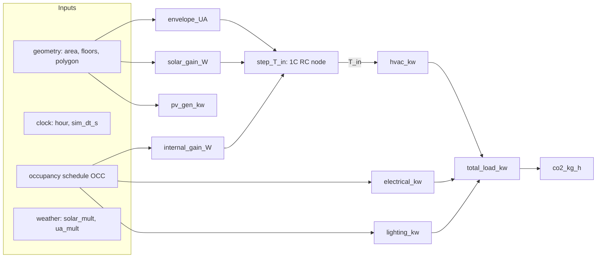

# The Energy Model

*A pocket-sized building-physics engine: one thermal node per building, a handful of standards-based constants, and pure functions that turn geometry plus a clock into kilowatts and kilograms of CO₂.*

This document explains the physics in `backend/energy.py` and how `backend/simulation.py` drives it. The model is deliberately small — one lumped thermal capacitance, one envelope conductance, a square-footprint geometry estimate — but every term is traceable to a real building-energy method (ISO 13790, SIA 2044). It is honest about that smallness; see [Assumptions & limitations](#assumptions--limitations).

See also: [Architecture](architecture.md) · [Simulation Loop](simulation.md) · [Retrofit Scenarios](retrofit-scenarios.md) · [Weather](simulation.md).

---

## 1. What the model computes

For each building, every simulation tick, the model answers two questions:

1. **What is the indoor air temperature now?** — advanced by a 1C RC thermal node (`step_T_in`).
2. **What does it draw from the grid (and emit), and what does its roof generate?** — HVAC + appliances + lighting, minus rooftop PV, times a CO₂ factor (`total_load_kw`, `pv_gen_kw`, `co2_kg_h`).

All functions in `backend/energy.py` are **pure** — they hold no state. The `Building` object in `backend/simulation.py` owns the only mutable variable, `T_in`, and feeds it back in on the next step.



---

## 2. The single-node 1C RC thermal model

### 2.1 The governing equation

The building interior is treated as a **single lumped thermal capacitance** $C$ at uniform temperature $T_\text{in}$, connected to the outdoor air $T_\text{out}$ through a single **heat-loss conductance** $UA$. Heat enters from solar gain through windows and internal gains (people + equipment). Conservation of energy on that one node gives a first-order ODE:

$$C \frac{dT_\text{in}}{dt} = Q_\text{gain} - UA\,(T_\text{in} - T_\text{out})$$

where

- $C = c_m \cdot A_\text{foot}$ — thermal mass [J/K], with $c_m$ = `cm_af` [J/K per m² of footprint] and $A_\text{foot}$ = footprint area;
- $UA$ — total heat-loss conductance [W/K]: envelope (§3) **plus** ventilation/infiltration (§3.1);
- $Q_\text{gain} = Q_\text{sol} + Q_\text{int}$ — solar + internal gains [W] (§4–§5).

This is the 5R1C single-zone network of **ISO 13790 / SIA 2044** collapsed to its simplest form: one resistor ($UA$) and one capacitor ($C$). The reduction drops the separate air/surface/mass node distinction that the full 5R1C model keeps — see limitations.

> Note: HVAC heat is **not** injected into this ODE. The thermal node free-floats; HVAC power (§6) is then computed separately as what it would take to drag $T_\text{in}$ back to the comfort band. The two are decoupled, which keeps the integrator simple but means $T_\text{in}$ can drift outside the setpoints (and reported HVAC power reflects that drift).

### 2.2 Euler integration and stability

`step_T_in` (`backend/energy.py`) advances the node one explicit (forward) Euler step of `sim_dt_s` simulation-seconds:

$$T_\text{in}^{\,t+\Delta t} = T_\text{in}^{\,t} + \frac{Q_\text{gain} - UA\,(T_\text{in}^{\,t} - T_\text{out})}{C}\,\Delta t$$

```python
UA     = (envelope_UA(...) + ventilation_UA(...)) * ua_mult
Cm     = p.cm_af * area_m2
Q_gain = solar_gain_W(...) + internal_gain_W(...)
Q_loss = UA * (T_in - T_out)
return T_in + (Q_gain - Q_loss) / Cm * sim_dt_s
```

Forward Euler on this linear node is stable only while the step stays below the system time constant. The characteristic (RC) time constant is

$$\tau = \frac{C}{UA} = \frac{c_m \, A_\text{foot}}{UA}.$$

Explicit Euler requires $\Delta t < 2\tau$ for stability and $\Delta t \ll \tau$ for accuracy. For a heavy building $\tau$ is on the order of **tens of hours** (the docstring cites ≈20 h), so the simulation's sample steps (seconds to tens of sim-minutes) are comfortably stable. The warm-start path `Building.prefill` (`simulation.py`) replays 24 h at `SAMPLE_MIN`·60 = 600 sim-second steps, still far below $2\tau$.

### 2.3 How the driver calls it

`Building.step_thermal` (`backend/simulation.py`) supplies the occupancy fraction and the per-hour façade orientation factor, then stores the new `T_in`:

```python
self.T_in = energy.step_T_in(
    self.T_in, T_out, self.area_m2, self.floors, self.type, occ, hour, sim_dt_s,
    solar_mult=solar_mult, ua_mult=ua_mult,
    orientation_factor=self._ori_factor(hour))
```

`solar_mult` and `ua_mult` are weather multipliers (clouds reduce solar gain; rain/wind raise envelope loss). Each building seeds `T_in` at the midpoint of its heating and cooling setpoints, `0.5·(T_HEAT + T_COOL)`.

---

## 3. Envelope UA breakdown

`envelope_UA(area_m2, floors, btype, params)` sums conductance over four surface classes — a standard surface-by-surface breakdown:

$$UA = U_\text{wall} A_\text{wall,net} + U_\text{win} A_\text{win} + U_\text{roof} A_\text{foot} + U_\text{base}\, A_\text{foot}\, b_F$$

The areas come from a **square-footprint estimate**. Given the footprint area $A_\text{foot}$, the perimeter of an equivalent square is

$$P = 4\sqrt{A_\text{foot}}, \qquad A_\text{wall,gross} = P \cdot (n_\text{floors} \cdot h_\text{floor})$$

with $h_\text{floor}$ = `FLOOR_HEIGHT` = 3.0 m. The window area is the wall-gross times the window-to-wall ratio, and the net opaque wall is the remainder:

$$A_\text{win} = A_\text{wall,gross}\cdot \text{WWR}, \qquad A_\text{wall,net} = A_\text{wall,gross} - A_\text{win}.$$

The ground slab uses a transmittance-reduction factor $b_F$ = `B_F` = 0.7 (SIA 380/1), reflecting that the ground is warmer than outdoor air, so the slab loses less than a wall of the same U-value. The slab U-value is a single global constant, `U_BASE` = 0.5 W/m²K (not per-type).

| Symbol | Source | Value | Meaning |
|---|---|---|---|
| `FLOOR_HEIGHT` | typical practice | 3.0 m | storey height |
| `B_F` | SIA 380/1 | 0.7 | ground-slab transmittance reduction |
| `U_BASE` | — | 0.5 W/m²K | ground-slab U-value (global) |

`ua_mult` scales the whole UA (default 1.0) so the weather model can raise envelope loss in rain/wind.

### 3.1 Ventilation & infiltration

`ventilation_UA(area_m2, floors, btype, params)` adds a second loss path alongside the envelope: outdoor air exchanged at a fixed whole-building air-change rate,

$$UA_\text{vent} = \rho c_p \cdot \frac{\text{ACH} \cdot V}{3600} = 0.34\,[\text{Wh/m}^3\text{K}] \cdot \text{ACH} \cdot V$$

with $V = A_\text{foot} \cdot n_\text{floors} \cdot h_\text{floor}$ the conditioned volume and `ach` a per-type constant (`ACH`, combined mechanical/natural ventilation + envelope leakage, no heat recovery): res 0.5, office 0.7, shop 0.9, hospital 1.2, school 1.0, industrial 0.8 h⁻¹. Both `step_T_in` and `hvac_kw` use $UA = (UA_\text{env} + UA_\text{vent}) \cdot \texttt{ua\_mult}$ — wind/rain plausibly drive infiltration as well as envelope loss. Retrofitting air-tightness or MVHR is modelled by scaling `ach` down (the `ach` measure in `backend/scenario.py`). The rate is constant — no occupancy- or window-opening-driven variation (the overheating heat-map keeps its own adaptive ventilation model, `backend/heatmap.py`).

---

## 4. Window solar gain with per-façade orientation

`solar_gain_W` computes heat entering through glazing:

$$Q_\text{sol} = A_\text{win} \cdot g_\text{win} \cdot I_\text{sol}(\text{hour}) \cdot f_\text{ori} \cdot \text{solar\_mult}$$

- $A_\text{win}$ — window area, same square-footprint estimate as §3;
- $g_\text{win}$ — solar heat gain coefficient (SHGC) of the glazing, per type;
- $I_\text{sol}$ — a synthetic clear-sky irradiance peaking at solar noon:
  $$I_\text{sol}(\text{hour}) = \max\!\bigl(0,\ \sin\tfrac{\pi(\text{hour}-6)}{12}\bigr)\cdot 500\ \text{W/m}^2$$
  (zero outside 06:00–18:00; `SOLAR_PEAK_W_M2` = 500);
- $f_\text{ori}$ — the per-façade orientation factor (below);
- `solar_mult` — cloud-cover scaler from the weather model.

### 4.1 The orientation factor

`facade_orientation_factor(polygon)` returns a callable `f(hour) -> [0,1]`. For each wall edge of the building polygon it computes the **outward normal** (0° = north, 90° = east, 180° = south), then weights by edge length. A moving solar azimuth sweeps east→south→west at 15°/hour:

$$\text{azimuth}(\text{hour}) = 90° + (\text{hour}-6)\cdot 10°$$

(Note the code uses **10°/hour** in `_factor`, despite the docstring's "15°/hour" comment — the implementation is the source of truth here.) Each façade receives $\max(0,\cos\Delta)$ of the irradiance, where $\Delta$ is the angle between its normal and the sun, then the length-weighted sum is normalised by total wall length:

$$f_\text{ori}(\text{hour}) = \frac{\sum_i \max\!\bigl(0,\cos(\text{normal}_i - \text{azimuth})\bigr)\cdot L_i}{\sum_i L_i}$$

A degenerate polygon (fewer than 3 points) falls back to an **isotropic 0.25**, which is also the default when no polygon is available. This is a simplified solar-incidence model, reduced to a scalar per hour.

---

## 5. Internal gains

`internal_gain_W` captures the heat that people and plugged-in equipment dump into the zone:

$$Q_\text{int} = A_\text{foot}\cdot n_\text{floors}\cdot e_\text{density}\cdot \text{occ}\cdot \eta_\text{heat}$$

where $e_\text{density}$ = `E_DENSITY` [W/m²] is the appliance power density, `occ` is the occupancy fraction (0–1) from the schedule, and $\eta_\text{heat}$ = `ELEC_TO_HEAT` = **0.9** — the fraction of appliance electricity that becomes sensible heat in the room. This is the same quantity as the appliance electrical load (§7) scaled by 0.9; both share `E_DENSITY` and the occupancy schedule. People's metabolic gain is not modelled separately — it is folded into this single equipment-derived term.

---

## 6. HVAC power, COP, and setpoints

`hvac_kw` returns the electrical power the HVAC system would draw to push $T_\text{in}$ back to the comfort band. It is **proportional to the UA-weighted temperature deviation**, divided by the system COP:

$$
P_\text{HVAC} =
\begin{cases}
\dfrac{UA\,(T_\text{heat}-T_\text{in})}{1000\cdot \text{COP}_\text{heat}} & T_\text{in} < T_\text{heat} \quad\text{(heating)}\\[2ex]
\dfrac{UA\,(T_\text{in}-T_\text{cool})}{1000\cdot \text{COP}_\text{cool}} & T_\text{in} > T_\text{cool} \quad\text{(cooling)}\\[1ex]
0 & T_\text{heat}\le T_\text{in}\le T_\text{cool} \quad\text{(deadband)}
\end{cases}
$$

The `/1000` converts W→kW. The **coefficient of performance** divides the thermal demand to give electrical input: a heat pump or chiller at COP 3 moves 3 kW of heat per 1 kW electric. Both `COP_HEAT` and `COP_COOL` are a single global constant **3.0** — there is no part-load curve and no outdoor-temperature dependence. Because the HVAC term reads the *current* free-floating $T_\text{in}$ rather than fully correcting it, the model behaves like a proportional controller sampled each tick, not a perfect thermostat.

---

## 7. Electrical, lighting, PV, and CO₂

### Appliance electrical load

`electrical_kw` — power density × total floor area × occupancy:

$$P_\text{elec} = \frac{A_\text{foot}\cdot n_\text{floors}\cdot e_\text{density}\cdot \text{occ}}{1000}\ \text{[kW]}$$

### Daylight-reduced lighting

`lighting_kw` — lighting power density times floor area times occupancy, **reduced by daylight**. A daylight factor peaks at solar noon and cuts demand by up to 80 %:

$$
\text{daylight}(\text{hour}) =
\begin{cases}
\max\!\bigl(0,\sin\tfrac{\pi(\text{hour}-6)}{12}\bigr) & 6\le \text{hour}\le 18\\
0 & \text{otherwise}
\end{cases}
$$

$$P_\text{light} = \frac{A_\text{foot}\cdot n_\text{floors}\cdot \text{LPD}\cdot \text{occ}\cdot (1 - 0.8\cdot\text{daylight})}{1000}\ \text{[kW]}$$

### Total load

`total_load_kw` returns `(total, hvac, electrical, lighting)` with a **floor of 0.5 kW** so buildings never read exactly zero on the dashboard:

$$P_\text{total} = \max\!\bigl(0.5,\ P_\text{HVAC}+P_\text{elec}+P_\text{light}\bigr)$$

### Rooftop PV

`pv_gen_kw` — a flat-roof approximation: usable roof area × panel efficiency × peak irradiance × cloud factor:

$$P_\text{PV} = \frac{A_\text{foot}\cdot f_\text{PV}\cdot \eta_\text{PV}\cdot \text{SOLAR\_PEAK}\cdot \text{solar\_mult}}{1000}\ \text{[kW]}$$

with $f_\text{PV}$ = `PV_ROOF_FRACTION` = 0.40 (usable fraction after obstacles/shading) and $\eta_\text{PV}$ = `PV_EFFICIENCY` = 0.18 (monocrystalline). The driver passes `solar_mult × day_factor`, where `day_factor` is the same noon-peaking sine used for solar gain, so PV only generates during daylight. Reduced to a single scalar per building.

### CO₂

`co2_kg_h` — a **single grid emission factor** applied to total load:

$$\dot{m}_{CO_2} = P_\text{total}\cdot \text{CO2\_GRID\_KG\_KWH}\quad[\text{kg/h}]$$

`CO2_GRID_KG_KWH` defaults to **0.233 kg CO₂/kWh** (UK National Grid 2024 average, DESNZ) and is localizable via `input/config.json` → `"locale": {"co2_grid_kg_kwh": ...}` for other grids. PV is **not** netted out of the CO₂ figure — emissions track gross consumption, not consumption-minus-generation.

---

## 8. The `Params` dataclass and `base_params`

Every per-building constant the model needs is bundled into a **frozen** dataclass, `Params` (`backend/energy.py`). Freezing means a cached or shared instance can never be mutated by accident.

```python
@dataclass(frozen=True)
class Params:
    u_wall; u_roof; u_win; win_wall; g_win; cm_af
    t_heat; t_cool; cop_heat; cop_cool
    e_density; lpd; pv_fraction; pv_efficiency
```

`base_params(btype)` builds the baseline `Params` for a building type from the module-level type-keyed dicts, and is **`@lru_cache`'d** — the constants never change at runtime, so each type resolves once and the live loop reuses one shared frozen instance (zero per-call allocation).

Every model function takes an optional `params` override and routes through the helper `_resolve(btype, params)`:

```python
def _resolve(btype, params):
    return base_params(btype) if params is None else params
```

- **Live simulation path:** passes `params=None` → falls back to the cached type baseline → behaviour identical to having no `Params` at all.
- **Retrofit path:** `backend/scenario.py` derives a modified copy with `dataclasses.replace(...)` (e.g. lower U-values, added rooftop PV) and threads it through every function to recompute the "after" case. See [Retrofit Scenarios](retrofit-scenarios.md).

Note that a few constants are **not** part of `Params` and stay global: `U_BASE`, `B_F`, `FLOOR_HEIGHT`, `ELEC_TO_HEAT`, `SOLAR_PEAK_W_M2`, and `CO2_GRID_KG_KWH`. A retrofit cannot vary these (though `CO2_GRID_KG_KWH` is configurable per locale at startup, see above).

---

## 9. Per-type constant catalog

All values below are the module constants in `backend/energy.py`; the schedules are in `backend/constants.py`. Sources are standards-based (ISO 13790 / SIA 380/1) and representative building-stock values.

| Type | `U_WALL` | `U_ROOF` | `U_WIN` | `WIN_WALL` (WWR) | `G_WIN` (SHGC) | `ACH` [h⁻¹] | `Cm_Af` [J/K·m²] | `T_HEAT` | `T_COOL` | `E_DENSITY` [W/m²] | `LPD` [W/m²] |
|---|---|---|---|---|---|---|---|---|---|---|---|
| res | 0.50 | 0.30 | 2.0 | 0.25 | 0.55 | 0.5 | 165 000 | 20 | 26 | 4.0 | 6.0 |
| office | 0.40 | 0.25 | 1.8 | 0.40 | 0.50 | 0.7 | 165 000 | 21 | 24 | 12.0 | 12.0 |
| shop | 0.60 | 0.35 | 2.5 | 0.35 | 0.60 | 0.9 | 100 000 | 19 | 25 | 8.0 | 20.0 |
| hospital | 0.40 | 0.25 | 1.8 | 0.30 | 0.50 | 1.2 | 165 000 | 22 | 26 | 13.0 | 11.0 |
| school | 0.45 | 0.28 | 2.0 | 0.30 | 0.55 | 1.0 | 165 000 | 21 | 26 | 4.0 | 14.0 |
| industrial | 0.70 | 0.45 | 2.8 | 0.15 | 0.55 | 0.8 | 80 000 | 18 | 30 | 26.5 | 10.8 |

U-values [W/m²K]. Setpoints [°C]. The pattern reflects intent: hospital/school have modern insulation; the industrial shed is poorly insulated (high U), low glazing (low WWR), light construction (low mass), high process loads, and a wide comfort band (18–30 °C). Heavy concrete construction sits at `Cm_Af` ≈ 165 000; light at ≈ 80 000.

**Global (not per-type):**

| Constant | Value | Source / note |
|---|---|---|
| `U_BASE` | 0.5 W/m²K | ground-slab U-value |
| `B_F` | 0.7 | SIA 380/1 slab reduction |
| `FLOOR_HEIGHT` | 3.0 m | typical storey height |
| `SOLAR_PEAK_W_M2` | 500 W/m² | simplified clear-sky peak |
| `ELEC_TO_HEAT` | 0.9 | appliance heat fraction |
| `COP_HEAT` / `COP_COOL` | 3.0 / 3.0 | heat pump / chiller |
| `PV_EFFICIENCY` | 0.18 | monocrystalline |
| `PV_ROOF_FRACTION` | 0.40 | usable roof fraction |
| `RHO_CP_AIR_WH_M3K` | 0.34 Wh/m³K | volumetric heat capacity of air |
| `CO2_GRID_KG_KWH` | 0.233 | UK National Grid 2024 (DESNZ); locale-configurable |
| `T_AVG_C` / `T_AMP_C` | 12 / 6 °C | synthetic outdoor profile |

### Occupancy schedules (`backend/constants.py`, `OCC`)

Occupancy is a piecewise-linear curve of `(hour, fraction)` points, interpolated by `piecewise()` in `simulation.py`, and multiplies internal gains, electrical, and lighting loads. Notable shapes: **res** peaks in the evening (0.9 at 19:00); **office** is a daytime plateau (0.85 at noon, ~0.06 overnight); **hospital** runs 24/7 (≈0.43 baseline, twin peaks of 1.0 at 09:00 and 14:00); **school** is empty at night and runs a 07:00–17:00 day; **industrial** is a low-overnight, high-shift (1.0 at 07:00 and 14:00) profile.

The synthetic outdoor temperature (`outdoor_temp_c`) is a daily cosine, minimum at 05:00 and maximum at 15:00:

$$T_\text{out}(\text{hour}) = 12 - 6\cos\!\frac{2\pi(\text{hour}-15)}{24}\quad[\degree C]$$

---

## 10. Assumptions & limitations

This is a teaching/visualisation model, not a code-compliant load calculation. Be aware of:

- **1C lumping.** A whole building is one capacitance at one temperature. The full ISO 13790 / SIA 2044 5R1C network distinguishes air, surface, and mass nodes; here they collapse into one. There is no inter-zone heat flow, no thermal stratification, no per-room comfort.
- **HVAC is decoupled from the thermal node.** `step_T_in` lets $T_\text{in}$ free-float and never injects HVAC heat back in; `hvac_kw` then reports the power *implied* by the current deviation. So the model is not a closed-loop thermostat — $T_\text{in}$ can sit outside the comfort band and reported HVAC power tracks that drift rather than perfectly holding setpoint.
- **Square-footprint geometry.** Wall and window areas come from `perimeter = 4√area`. Real footprints with high perimeter-to-area ratios (L-shapes, courtyards) under-count envelope area and thus UA. The polygon is used only for the solar **orientation** factor, not for actual surface areas.
- **No DHW, no latent load; ventilation is a fixed rate.** Domestic hot water and humidity (latent) loads are entirely absent. Ventilation + infiltration is modelled (§3.1) but as one constant per-type air-change rate — no demand-controlled ventilation, no occupancy or window-opening variation, no heat recovery unless retrofitted via the `ach` measure.
- **Single COP, no part-load or weather dependence.** Heating and cooling both use a fixed COP of 3.0. No defrost, no chiller efficiency curve, no dependence on outdoor temperature or load fraction.
- **Single energy carrier, single CO₂ factor.** Everything (HVAC, appliances, lighting) is electricity, emitting at one flat grid factor (0.233 kg/kWh). No gas, no district heat, no time-of-use or marginal grid mix, and PV is not netted out of emissions.
- **People metabolic gain folded into equipment.** Internal gain is `0.9 ×` appliance load only; occupant body heat is not a separate term.
- **Synthetic, location-agnostic weather in the live loop.** Outdoor temperature is a fixed cosine (12 ± 6 °C) and irradiance a fixed 500 W/m² noon peak; clouds/rain enter only as the scalar `solar_mult` / `ua_mult` from the weather model. Real climate files (EPW/TMY) are supported in the headless annual mode only (`backend/annual.py`, `python -m backend.batch --annual --weather file.epw`).
- **Code/comment drift.** The orientation factor's solar azimuth sweeps at **10°/hour** in code despite a 15°/hour comment. The implementation governs.

For how these per-building numbers are aggregated, sampled into history, and exposed to the dashboard, see [Simulation Loop](simulation.md); for varying the `Params` to model upgrades, see [Retrofit Scenarios](retrofit-scenarios.md).
