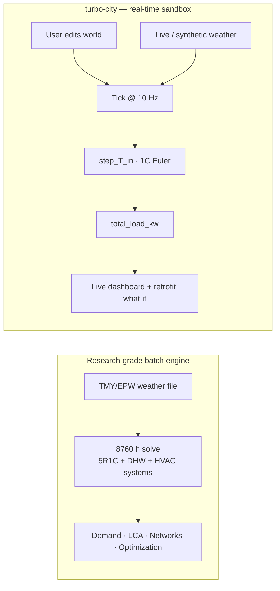

# Modeling Scope & Limitations

*A real-time, click-anything city energy sandbox — built for interactivity, not for batch-research accuracy.*

turbo-city is an **interactive teaching and exploration sandbox**. Every building's energy state is recomputed on every simulation tick, so you can change a building's height, drag the clock, watch the weather roll in, and see loads respond *live*. That design goal — responsiveness over fidelity — is the single most important thing to understand about its energy model, and it explains every simplification documented below.

The model deliberately trades the 8760-hour batch rigor of a full research-grade urban energy engine for **sub-100-millisecond interactivity**. It keeps the *physical structure* of a standard building-energy method — a single-zone RC thermal node, per-type envelope and density constants, occupancy schedules, rooftop PV — but reduces each to the cheapest form that still behaves correctly under continuous, interactive recomputation. This document is about exactly what that trade buys, and what it costs.

For the equations and constants themselves, see the [Energy Model](energy-model.md). For how the pieces fit together, see the [Architecture](architecture.md) doc.

---

## Two different jobs

A real-time sandbox and a research-grade engine answer different questions, and the difference is structural, not cosmetic.

| | **Research-grade batch engine** | **turbo-city** |
|---|---|---|
| **Primary job** | Demand + supply analysis for district planning | Interactive teaching / what-if exploration |
| **Time resolution** | Full year, 8760 hourly steps, batch | Live, recomputed every tick (default 10 Hz) |
| **Run model** | Run once, inspect outputs (CSV / GIS layers) | Continuous loop; edit the world and watch it respond |
| **Weather** | Full typical-year (TMY/EPW) file | Live loop: synthetic daily sinusoid *or* live Open-Meteo (`backend/weather.py`); headless annual mode accepts real EPW/TMY files (`backend/annual.py`) |
| **Thermal model** | 5R1C (ISO 13790), multi-resistance | 1C reduction of the same RC family (`backend/energy.py`) |
| **Calibration target** | Validated against measured stock | Per-type defaults benchmarked by `backend/validate.py`; per-building measured-data overrides via `backend/overrides.py` |
| **Output** | Demand, emissions, LCA, network sizing, optimization | Live dashboard, per-building detail, retrofit before/after |

The defining property of turbo-city is in `Simulation.tick()` (`backend/simulation.py`): on **every** tick it advances each building's thermal node and re-estimates its load.

```python
for b in self.buildings:
    b.step_thermal(T_out, hour, sim_dt_s, wp['solar_mult'], wp['ua_mult'])
self.total_load_kw = sum(
    b.estimate_load(hour, wp['ua_mult'], wp['solar_mult']) for b in self.buildings)
```

A full year of 8760 multi-resistance zone solves per building cannot run inside that loop while staying interactive. The 1C reduction can. That is the whole design thesis.



---

## What turbo-city actually models

Grounded in `backend/energy.py` and `backend/scenario.py`, the model covers exactly four physical channels plus a generation term. Nothing else is simulated.

| Channel | Function | What it captures | Simplification |
|---|---|---|---|
| **Envelope conductance** | `envelope_UA()` | Walls, windows, roof, ground slab → one UA [W/K] | Footprint assumed **square** (perimeter = 4√area); slab uses a fixed reduction factor `B_F = 0.7` |
| **Ventilation + infiltration** | `ventilation_UA()` | Outdoor-air exchange at a per-type air-change rate → a second UA [W/K] | **Constant** ACH per type; no demand control, occupancy variation, or heat recovery (retrofit scales `ach` down) |
| **Thermal mass / lag** | `step_T_in()` | 1C RC node: `C·dT/dt = Q_gain − UA·(T_in − T_out)` | **Single** capacitance per building (whole structure), forward-Euler integration |
| **Solar gain** | `solar_gain_W()`, `facade_orientation_factor()` | Window gain weighted by per-façade orientation vs. a moving sun | Sun azimuth is a **linear** sweep; **no shading**, no diffuse/direct split, isotropic `SOLAR_PEAK_W_M2 = 500` |
| **Internal + appliance + lighting** | `internal_gain_W()`, `electrical_kw()`, `lighting_kw()` | Power density × floor area × occupancy schedule; lighting cut by a daylight factor | `ELEC_TO_HEAT = 0.9` of appliance load becomes heat; occupancy is a fixed per-type piecewise curve |
| **HVAC** | `hvac_kw()` | Proportional restore to setpoint, divided by a fixed COP | One **COP = 3.0** for both heating and cooling; no part-load curve, no system typing |
| **Rooftop PV** | `pv_gen_kw()` | Flat-roof area × usable fraction × panel efficiency × irradiance | `PV_ROOF_FRACTION = 0.40`, `PV_EFFICIENCY = 0.18`; no tilt, inverter, or self-consumption model |
| **Operational CO₂** | `co2_kg_h()` | Grid electricity × emission factor | **Single** carrier: `CO2_GRID_KG_KWH = 0.233` (UK grid). All end uses are electric. |

A few honest details worth surfacing:

- **Everything is electric.** HVAC, appliances, lighting, and the PV offset all resolve to one kW number and one emission factor. There is no gas meter, no district heat, no fuel mix.
- **The model is pure and parameterized.** Every function takes an optional frozen `Params` (resolved per type by `base_params(btype)`). This is what makes the retrofit comparison in `backend/scenario.py` possible *without* a second live simulation — it just replays a 24 h day under a modified `Params` and diffs the totals.
- **`total_load_kw()` floors output at 0.5 kW** so buildings never read a flat zero on the dashboard — a UI nicety, not physics.
- **CO₂ counts only operational electricity.** No embodied carbon, no lifecycle.

---

## What a fuller model adds

These are not bugs or oversights — they are scope choices. Each item below is something a full research-grade engine models and turbo-city deliberately omits to stay real-time.

| Capability | In a full model | In turbo-city | Why omitted here |
|---|---|---|---|
| **Domestic hot water (DHW)** | Full demand + storage losses | ❌ Not modeled | A whole separate demand stream + draw schedules; large code, little interactive payoff |
| **Ventilation & infiltration** | Air-change rates, heat recovery | ⚠️ Fixed per-type ACH (`ventilation_UA()`) | Constant rate, no heat recovery or demand control — the dynamic part stays out of the tick loop |
| **Latent loads / humidity** | Sensible **and** latent | ❌ Sensible-only | The 1C node tracks dry-bulb temperature only |
| **Typed supply systems** | Boilers, chillers, HPs, CHP with curves | ❌ One fixed COP = 3.0 | Part-load efficiency + system selection is a model in itself |
| **District heating/cooling networks** | Network routing, pumping, losses | ❌ Building-standalone | Each building is an island; no shared plant or pipes |
| **Detailed solar radiation** | Ray-traced irradiation with **shading** between buildings | Per-façade cosine sweep, **no shading** | Ray-traced radiation per timestep is far too heavy for a tick loop |
| **Multi-carrier emissions** | Gas, oil, district heat, grid mix, time-varying factors | ❌ Single static grid factor | All energy is electric here, so one factor suffices |
| **Embodied carbon / LCA** | Materials, construction, end-of-life | ❌ Operational CO₂ only | Lifecycle accounting is out of scope for a live sandbox |
| **Optimization** | Supply-system + retrofit optimization | ❌ User explores manually | turbo-city's "optimization" is *you*, dragging sliders |
| **Real weather year** | 8760 h TMY/EPW | ⚠️ Batch only: `python -m backend.batch --annual --weather file.epw` (`backend/annual.py`) | The live loop stays on "now"; the year runs headless on the same pure model |

> A useful mental model: turbo-city implements roughly the **demand-side sensible thermal core** of a full model's first stage, reduced to one capacitance and one carrier, and wraps it in a real-time loop. The supply-side, network, LCA, and optimization stages have no counterpart here.

---

## Why the simplifications are the right call *here*

Each simplification buys a specific interactive capability:

- **1C instead of 5R1C** → the thermal step is a handful of floating-point ops per building, cheap enough to run for every building on every tick *and* to replay a full 24 h day instantly for retrofit comparison.
- **No shading / cosine-sweep sun** → solar gain is `O(walls)` per building, not a ray-trace, so orientation still *matters* (a south-facing façade gains more) without a radiation solver.
- **One COP, one carrier** → the entire energy state collapses to a single kW and a single kg/h, which is exactly what a learner needs to reason about: "more insulation → less HVAC kW → less CO₂."
- **Pure, parameterized functions** → the retrofit panel is a near-free feature. Because the model has no hidden state, `scenario.compare()` can evaluate baseline and retrofit `Params` for the same geometry and hand back an apples-to-apples diff with capex and payback (`backend/scenario.py`).

The retrofit comparison even runs on a **deterministic design day** (synthetic temperature, unit weather multipliers) precisely so results are reproducible and reflect *only* the retrofit — a property that only holds because the underlying model is pure and side-effect-free.

---

## Assumptions & limitations

Read this section as the "do not over-trust" list. The numbers are *plausible*, not *validated*.

1. **Geometry is idealized.** Every building is treated as a square prism (`perimeter = 4·√area`, `height = floors × 3 m`). Real footprint shape only enters through the façade-orientation factor.
2. **One thermal zone, one capacitance.** No floor-by-floor, room-by-room, or core/perimeter distinction. Forward-Euler integration is stable only while the timestep stays well below `Cm/UA` (~20 h for heavy buildings) — true at normal time-warp, but extreme fast-forward could drift.
3. **Sensible heat only.** No humidity, latent load, or DHW. Ventilation + infiltration is a fixed per-type air-change rate (no heat recovery, no occupancy variation).
4. **All-electric, single grid factor.** No fuel mix, no time-of-day emissions, no gas or district heat. The factor itself is localizable via `input/config.json` → `"locale"`, but it stays a single static number.
5. **Fixed, idealized HVAC.** COP = 3.0 flat; no equipment sizing, part-load behavior, or system type. HVAC is a pure proportional restore to setpoint.
6. **Solar is coarse.** Linear azimuth sweep, isotropic peak irradiance, no inter-building shading, no diffuse/direct decomposition.
7. **Schedules are deterministic per type.** Occupancy comes from a fixed piecewise curve per building type (`constants.OCC`); there is no stochastic occupancy or per-building variation.
8. **Constants are representative defaults**, drawn from SIA/ISO standards and typical building-stock values, not calibrated against any specific building stock or measured data. Two hooks narrow the gap: per-building overrides (`backend/overrides.py`, including measured annual kWh for model-vs-measured reporting) and the archetype benchmark check (`python -m backend.validate`).
9. **Retrofit costs are placeholders.** The default `MEASURE_COST` unit costs and tariff in `backend/scenario.py` are early-stage planning figures — supply a real local cost book via `input/config.json` → `"locale": {"measure_cost_per_m2": ...}` (no code change needed).
10. **No district-scale interactions.** Buildings do not share plant, networks, or shading with each other in the energy model.
11. **Terrain is cosmetic.** The optional DEM terrain / relief rendering (`backend/terrain.py`) never enters the physics: no altitude temperature offset, no slope or horizon effects on solar gain.

None of these undermine the project's purpose. They are the price of a model that recomputes an entire city every tick and lets a student *feel* how a building responds to its envelope, its schedule, the sun, and the weather.

---

## In one sentence

> turbo-city is to a research-grade urban energy engine what a flight *simulator* is to a wind-tunnel campaign: it borrows the real physics' shape, strips it to what runs in real time, and optimizes for the human at the controls rather than for a publishable result.

If you want the math and constants behind the model, continue to the [Energy Model](energy-model.md). If you want to see where these functions are called in the live loop, see the [Architecture](architecture.md) doc.
