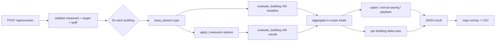

# Retrofit Scenario Analysis

*A stateless, deterministic "before vs. after" recompute that replays every building through a 24-hour design day under baseline and retrofitted parameters — no second live simulation required.*

Turbo-city's retrofit engine answers one question: **if we apply this package of upgrades to (some of) the city, what changes?** It is implemented in [`backend/scenario.py`](../backend/scenario.py) on top of the parameterized energy model in [`backend/energy.py`](../backend/energy.py). The result is a consultant-style deliverable: city totals before and after, a per-metric delta, a 24-hour load profile for each case, an indicative cost/payback block, and a per-building table that drives the map overlay and CSV export.

See also: [Energy Model](energy-model.md) · [Architecture](architecture.md).

---

## Why a recompute, not a second live sim

The live simulation ([`backend/simulation.py`](../backend/simulation.py)) is stateful: it carries each building's indoor temperature `T_in`, advances on a real-time clock, and is perturbed by live/fetched weather (cloud and wind multipliers). That makes it a poor instrument for an A/B comparison — the "before" and "after" worlds would diverge for reasons unrelated to the retrofit (clock position, weather noise, thermal history).

The scenario engine instead does a **clean-room analytical recompute**. For every building it replays a full design day twice — once under baseline `Params`, once under retrofitted `Params` — using a deterministic synthetic weather basis and identical thermal settling. The diff therefore reflects *only* the retrofit. Key properties, straight from the module docstring:

- **No second live simulation, no agents, no live weather.** The comparison is reproducible from the building geometry/type alone.
- **Deterministic weather basis.** Outdoor temperature comes from `energy.outdoor_temp_c` (a fixed sinusoid, min at 5am / max at 3pm) with **unit cloud and wind multipliers** — i.e. `solar_mult = 1.0`, `ua_mult = 1.0`. No clouds, no rain, no wind.
- **Stateless.** `compare()` reads building geometry, type, and occupancy but never mutates the running simulation.



---

## The `Params` foundation

The recompute is only possible because the energy model is fully parameterized. [`backend/energy.py`](../backend/energy.py) defines a frozen dataclass `Params` holding every physical knob for one building (U-values, window-to-wall ratio, glazing SHGC, thermal mass, setpoints, COPs, appliance/lighting density, PV fraction and efficiency). `base_params(btype)` builds the baseline `Params` for a building type from the type-keyed module constants and is `@lru_cache`d, so the live loop reuses one shared frozen instance.

Every model function (`step_T_in`, `hvac_kw`, `total_load_kw`, `pv_gen_kw`, …) accepts an optional `params=` override. The retrofit "after" run simply derives a modified copy with `dataclasses.replace` and feeds it through the **same** functions. Because `Params` is frozen, the shared baseline can never be mutated by accident.

```python
# scenario.apply_measures (abridged)
fields = {}
for key, (_, field) in MULTIPLIER_MEASURES.items():
    if key in measures:
        fields[field] = getattr(params, field) * measures[key]   # scale a loss/capacity field
if "cop" in measures:
    fields["cop_heat"] = params.cop_heat * measures["cop"]
    fields["cop_cool"] = params.cop_cool * measures["cop"]
for key, field in SETPOINT_MEASURES.items():
    if key in measures:
        fields[field] = getattr(params, field) + measures[key]   # add a °C delta
return replace(params, **fields) if fields else params
```

Note the identity trick: an **empty** measures dict returns the *same* `Params` instance unchanged. `compare()` uses `rp is bp` to detect "no retrofit for this building" and reuse the baseline evaluation instead of recomputing — a cheap no-op short-circuit.

---

## Measures

A *scenario* is a dict of measures. Two kinds exist.

### Multiplier measures (factors)

Each scales exactly one `Params` field by a positive factor in `(0, 10]`. The convention: **`< 1` improves loss/consumption fields**, **`> 1` improves capacity fields**, and **`1.0` is a no-op**.

| Key | Label | `Params` field | Direction (improvement) |
|---|---|---|---|
| `u_wall` | Wall insulation | `u_wall` | factor `< 1` (less conductance) |
| `u_roof` | Roof insulation | `u_roof` | factor `< 1` |
| `u_win` | Glazing (window U-value) | `u_win` | factor `< 1` |
| `g_win` | Glazing solar control | `g_win` | factor `< 1` (less solar gain) |
| `win_wall` | Window-to-wall ratio | `win_wall` | factor `< 1` (less glazed area) |
| `ach` | Air-tightness / MVHR | `ach` | factor `< 1` (less air exchange) |
| `lpd` | LED lighting | `lpd` | factor `< 1` |
| `e_density` | Efficient appliances | `e_density` | factor `< 1` |
| `pv_fraction` | Rooftop PV area | `pv_fraction` | factor `> 1` (more usable roof) |
| `cop` | Heat-pump / chiller upgrade | `cop_heat` **and** `cop_cool` | factor `> 1` (more efficient) |

`cop` is special: a single factor scales **both** the heating and cooling COP.

### Setpoint measures (°C deltas)

These **add** a temperature delta (range `[-10, +10] °C`) to a setpoint rather than multiplying:

| Key | `Params` field | Effect |
|---|---|---|
| `t_heat_delta` | `t_heat` | **negative** lowers heating demand (setback) |
| `t_cool_delta` | `t_cool` | **positive** lowers cooling demand (setup) |

Both `hvac_kw` (heating when `T_in < t_heat`, cooling when `T_in > t_cool`) and the indoor-temperature settling in `evaluate_building` (which starts `T_in` at the setpoint midpoint `0.5·(t_heat + t_cool)`) respond to these deltas automatically.

`validate_measures` rejects unknown keys, factors outside `(0, 10]`, and deltas outside `[-10, +10]`, raising `ValueError` → HTTP 400.

---

## Targeting

By default a scenario applies city-wide. A `target` restricts the retrofit to a subset:

- `target.types` — a non-empty list of building types (must be valid `energy.BUILDING_TYPES`: `res, office, shop, hospital, school, industrial`).
- `target.ids` — a non-empty list of integer building ids.

A building is **in scope** if it matches *either* the type list *or* the id list (logical OR — see `_in_scope`). Out-of-scope buildings keep baseline parameters in both the "before" and "after" runs, so the delta reflects only the targeted retrofit.

Crucially, the **headline totals and load profiles cover only the in-scope set** (the whole city when `target is None`). This prevents a small, targeted retrofit from being diluted into invisibility by hundreds of untouched buildings. The per-building rows, however, are returned for *every* building with an `in_scope` flag.

---

## The 24-hour recompute (`evaluate_building`)

For one building under one `Params`, `evaluate_building` runs a **two-pass** design day:

1. **Pass 1 (settle):** step `T_in` through 144 ten-minute samples (`HISTORY_LEN = 144`, `SAMPLE_MIN = 10`) starting from the setpoint midpoint, but record nothing. This washes out the arbitrary initial condition.
2. **Pass 2 (measured):** repeat, this time integrating the load.

Both baseline and retrofit get identical two-pass treatment, so the diff is apples-to-apples regardless of absolute thermal settling. Each measured step:

- advances `T_in` via `energy.step_T_in` (1C RC node, using the building's façade `_ori_factor(h)` for solar orientation);
- evaluates `energy.total_load_kw` → `(total, hvac, electrical, lighting)`;
- computes PV from a clear-sky day factor (`sin` curve, 6–18h) via `energy.pv_gen_kw`, using the retrofitted `pv_fraction`/`pv_efficiency`;
- accumulates energy as `power × DT_H`, where `DT_H = SAMPLE_MIN/60 = 1/6 h`.

Daily outputs per building:

```
energy_kwh   = Σ load · DT_H          (total site energy for the day)
hvac_kwh, elec_kwh, light_kwh         (component breakdowns)
co2_kg       = Σ co2_kg_h(load) · DT_H (= load · 0.233 · DT_H)
pv_kwh       = Σ pv · DT_H
net_kwh      = energy_kwh − pv_kwh     (net of on-site PV)
peak_kw      = max instantaneous load over the day
eui_kwh_m2_yr = energy_kwh · 365 / max(1, area · floors)
profile_kw[24] = mean total load in each clock hour
```

City aggregation (`_aggregate`) sums the additive metrics across in-scope buildings and computes a **floor-area-weighted** EUI. **Peak is deliberately excluded from city totals** — a sum of per-building peaks is not the coincident city peak, so peak is kept per-building only.

---

## Cost model: capex, annual saving, simple payback

> **Be candid:** these figures are *indicative planning estimates*, the payback is **undiscounted**, and the cost book is a placeholder. Treat them as order-of-magnitude, not as a financial appraisal.

### Capex

`_capex` sums, over the in-scope buildings, an indicative cost in currency/m² at *full* application of each measure, scaled linearly by how aggressively the measure is set. The default cost book `MEASURE_COST` (key → £/m², area basis) is listed below; the unit costs, the currency symbol, and the default tariff can all be localized via `input/config.json` → `"locale"` (see the README) without touching code:

| Measure | £/m² (full) | Area basis | Intensity used |
|---|---|---|---|
| `u_wall` | 60 | floor (`area·floors`) | `1 − f` |
| `u_roof` | 25 | roof (`area` footprint) | `1 − f` |
| `u_win` | 80 | floor | `1 − f` |
| `g_win` | 40 | floor | `1 − f` |
| `ach` | 30 | floor | `1 − f` |
| `lpd` | 12 | floor | `1 − f` |
| `e_density` | 20 | floor | `1 − f` |
| `cop` | 70 | floor | `f − 1` |
| `pv_fraction` | 250 | roof | `PV_ROOF_FRACTION · (f − 1)` |

Intensity is clamped to `[0, 1]`. So a measure that *improves* a loss field (factor `f < 1`) costs proportionally to `1 − f`; capacity measures (`cop`, `pv_fraction`, `f > 1`) cost proportionally to `f − 1`. A no-op (`f = 1`) costs nothing. Note `win_wall` and the setpoint deltas have **no cost line** — they contribute to savings but are treated as free in the capex model.

$$\text{capex} = \sum_{b \in \text{scope}} \sum_{\text{measure}} \text{unit}_m \cdot \min(1, \text{intensity}_m) \cdot A_{\text{basis}}(b)$$

where $A_{\text{floor}} = \max(1, \text{area} \cdot \text{floors})$ and $A_{\text{roof}} = \max(1, \text{area})$.

### Annual saving and payback

Savings are driven by the **net** energy reduction (after on-site PV) at a single flat tariff (default `£0.28/kWh`, overridable via `tariff`, validated to `0..100`):

$$
\text{annual kWh} = (\text{net}_{\text{base}} - \text{net}_{\text{retro}}) \cdot 365, \qquad
\text{annual savings} = \text{annual kWh} \cdot \text{tariff}
$$

$$
\text{payback (years)} = \frac{\text{capex}}{\text{annual savings}}
$$

Payback is `None` when annual savings are effectively zero (`≤ 1e-6`), e.g. a no-op scenario or one that increases consumption. CO₂ savings are reported in tonnes/year: `(co2_base − co2_retro) · 365 / 1000`.

**Caveats, explicitly:**

- The day is scaled to a year by a flat `× 365` — there is **no seasonal weather variation** (one design day stands in for the whole year).
- The tariff is a **single flat retail price**; no time-of-use, no export tariff, no demand charges.
- PV value is captured only through `net_kwh` (self-consumption at the import tariff) — no separate feed-in revenue.
- Payback is **simple and undiscounted**: no discount rate, no maintenance, no degradation, no inflation, no end-of-life.
- The cost book is a flat £/m² placeholder, independent of building type or measure interaction. `win_wall` and setpoint changes are costed at zero.

---

## Per-building outputs → map overlay & CSV

Every building (in or out of scope) gets a row from `_building_row`:

```json
{
  "id": 12, "name": "Block A", "type": "res",
  "area_m2": 320.0, "floors": 4, "in_scope": true,
  "baseline": { "energy_kwh": 410.2, "co2_kg": 95.6, "pv_kwh": 88.1, "eui_kwh_m2_yr": 116.9 },
  "retrofit": { "energy_kwh": 268.7, "co2_kg": 62.6, "pv_kwh": 88.1, "eui_kwh_m2_yr": 76.6 },
  "delta_pct": -34.5
}
```

`delta_pct` is the per-building change in daily site energy (`(retro − base)/base · 100`), which the frontend uses to color a **savings map overlay**. The same rows feed `POST /api/export/scenario.csv`, which flattens them into columns: `id, name, type, floors, area_m2, in_scope, baseline_energy_kwh_day, retrofit_energy_kwh_day, delta_pct, baseline_co2_kg_day, retrofit_co2_kg_day, baseline_pv_kwh_day, retrofit_pv_kwh_day, baseline_eui_kwh_m2_yr, retrofit_eui_kwh_m2_yr`. The CSV is UTF-8 with BOM, named `retrofit_<city-slug>.csv`.

---

## API

`POST /api/scenario` (see [`backend/main.py`](../backend/main.py)) takes a JSON body; `measures` is required, `target` and `tariff` optional.

```json
{
  "measures": {
    "u_wall": 0.5,
    "u_roof": 0.6,
    "u_win": 0.7,
    "lpd": 0.5,
    "e_density": 0.8,
    "cop": 1.5,
    "pv_fraction": 1.5,
    "t_heat_delta": -1.0,
    "t_cool_delta": 1.0
  },
  "target": { "types": ["res", "office"] },
  "tariff": 0.28
}
```

The response contains `measures`, `target`, `n_buildings`, `n_in_scope`, `baseline`/`retrofit` city totals, a per-metric `delta` (`abs` and `pct`), `profile_kw.baseline`/`profile_kw.retrofit` (24 hourly values each), the `cost` block, and the `buildings` rows. Invalid input returns **HTTP 400** with the `ValueError` message. `POST /api/export/scenario.csv` accepts the identical body and returns the per-building CSV.

---

## Assumptions & limitations

- **One deterministic design day, scaled ×365.** No seasons, no real or fetched weather; cloud and wind multipliers are pinned to 1.0. Annual figures inherit any bias in that single day.
- **In-scope-only totals.** Headline numbers and profiles cover the targeted set, not the whole city. Read `n_in_scope` to interpret them.
- **OR targeting.** A building matches if it is in `target.types` *or* `target.ids` — there is no AND/intersection mode.
- **Simplified physics.** Inherited from the 1C RC energy model: square-footprint envelope estimate, isotropic solar, single grid CO₂ factor (`0.233 kg/kWh`), 0.5 kW load floor per building, ground-floor transmittance factor `B_F`. See [Energy Model](energy-model.md).
- **PV self-consumption only.** PV reduces `net_kwh` at the import tariff; no export/feed-in modelling.
- **Indicative, undiscounted economics.** Flat £/m² cost book, flat tariff, simple undiscounted payback. `win_wall` and setpoint deltas are costed at zero. Not a financial appraisal.
- **City peak is not summed.** Per-building peaks are reported but never aggregated into a city total, because they are non-coincident.
