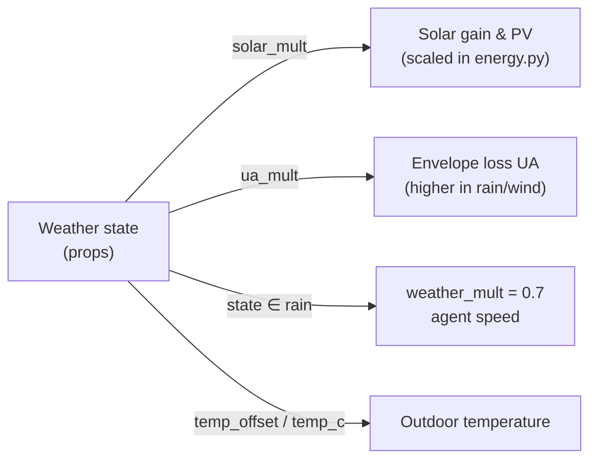
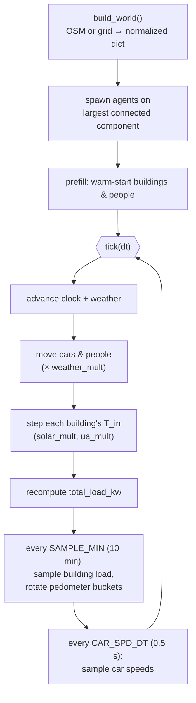

# The City & Agent Simulation

*A real OpenStreetMap neighbourhood (or a hand-built grid) turned into a living, tickable world of buildings, cars, people, and weather.*

This document covers the world-building and agent layer of turbo-city: how a city is assembled from real geometry, how cars and people random-walk the street graph, how weather modulates the physics, and how the 24-hour clock, warm-start, and live edits fit together. The thermal/electrical math that runs inside each building lives in [the energy model](energy-model.md); here we focus on the world, the agents, and the simulation loop in `backend/simulation.py`.

---

## Two worlds, one interface

The simulation never hard-codes geometry. A run is selected by `input/config.json` (`"world": "map"` or `"grid"`), and the chosen builder returns a single normalized dict (`backend/simulation.py`):

```python
WORLD_BUILDERS = {
    "map":  osm_world.build_world,   # real OSM area from input/map.json
    "grid": grid_world.build_world,  # hand-made scene from input/grid.json
}
```

Both builders emit the **same shape**, so the rest of the engine is world-agnostic:

| Key | Meaning |
| --- | --- |
| `name`, `radius_m` | display name and extent |
| `n_cars`, `n_people` | how many agents to spawn |
| `car_speed_mps`, `person_speed_mps` | per-world `[min, max]` speed overrides |
| `buildings` | id, name, type, floors, polygon (meters), area, center |
| `roads` | id, name, class, width, drivable, polyline points |
| `parks`, `water` | decorative polygons |
| `lamps`, `signals` | street lamps and traffic-signal nodes |
| `car_graph`, `ped_graph` | `{nodes, adj}` street graphs for driving / walking |

Everything is in **local meters**. The frontend gets the static layout via `Simulation.world()`; the graphs stay server-side because only the agents walk them.

---

## Building the world from OpenStreetMap

`backend/osm_world.py` pulls a real area and converts it to simulation data using **only the Python standard library** — no `osmnx`, `geopandas`, or shapely.

### Fetch and cache

`fetch_overpass(center, radius_m)` issues one Overpass QL query for buildings, highways, street lamps, traffic signals, parks/gardens, water, and grass/meadow landuse within an `(around:radius,lat,lon)` disk. The raw JSON is cached under `backend/data/<cache_file>`, so the network is touched **once** — subsequent runs are offline (`load_raw`). For the shipped default (`input/map.json`) that is a 300 m radius around Cambridge Market Square.

### Projection to local meters

OSM gives WGS84 lat/lon; `project()` flattens it to a local tangent plane centered on the area:

$$x = (\text{lon} - \text{lon}_0)\cdot 111320 \cdot \cos(\text{lat}_0), \qquad y = (\text{lat}_0 - \text{lat})\cdot 110540$$

Note **y grows southward** so the isometric front-end view reads naturally (north is "up and back"). The same x-east / y-south convention is assumed throughout the agent and façade code.

### Classifying buildings

Each closed `way[building]` becomes a footprint. `classify_building(tags)` collapses the long OSM tag vocabulary into three simulation types:

| Result | Triggered by |
| --- | --- |
| `res` | `building` in `{residential, house, apartments, dormitory, terrace, semidetached_house, detached}` |
| `shop` | `building` in `{retail, commercial, supermarket, kiosk}` **or** any `shop=*` tag |
| `office` | everything else (the default) |

> Note: `classify_building` only ever returns `res`, `shop`, or `office`. The energy model also defines `hospital`, `school`, and `industrial` types, but OSM imports never produce them automatically — they appear only via grid-world specs or `add_building` edits.

Footprints smaller than 20 m² are dropped. Floor count comes from `building:levels` when present (clamped 1–12), otherwise a type-dependent random draw (`res` 2–3, `shop` 1–2, `office` 3–5). Unnamed buildings get a street address if available, else a generated name like *"Cedar Heights"* from `BLD_PRE` × `BLD_SUF[type]`.

### Roads and the street graph

Highways are kept only if their class is in `ROAD_CLASSES`, which also sets **width** (used for car speed) and **drivability**:

| Class group | Width (m) | Drivable |
| --- | --- | --- |
| primary / secondary / tertiary (+ links) | 6–9 | yes |
| residential, unclassified | 6 | yes |
| living_street | 5 | yes |
| service | 4 | yes |
| pedestrian | 4 | **no** (walk only) |
| footway / path / cycleway / steps | 2.5 | **no** |

Two adjacency maps are built node-by-node along each polyline:

- **`car_adj`** — drivable roads only; each edge stores `(neighbor_id, width)` so cars can slow on narrow streets.
- **`ped_adj`** — all roads **except `steps`**; edges are bare neighbor ids.

Shared OSM node ids automatically stitch crossing and abutting roads into one connected graph. Sparse OSM lamp data (<15 lamps) is replaced by `synthesize_lamps`, which staggers lamps left/right along drivable roads every ~30 m. Traffic signals get a random `phase_offset` so they don't all blink in unison.

---

## The offline grid world

`backend/grid_world.py` is the deterministic test scene: `input/grid.json` *is* the geometry — buildings, roads, lamps, signals, agent counts, all explicit. There is no Overpass call and no network dependency, which makes it ideal for reproducible tests and for exercising the engine without internet.

The grid builder shares `ROAD_CLASSES`, `centroid`, and `shoelace_area` with the OSM module and builds its graphs through `build_graphs(roads)`. The key difference from OSM is node identity: instead of OSM ids, points are **merged by rounded coordinate** (0.1 m), so any two road polylines that touch at a shared `(x, y)` connect at one graph node:

```python
key = (round(p[0], 1), round(p[1], 1))   # crossing roads share this node
```

`build_graphs` is reused at runtime whenever roads are edited (see [Live edits](#live-edits)), so a hand-built grid and an edited OSM map go through the exact same graph construction.

---

## Agents: random walk on the street graph

All moving agents derive from `Walker` (`backend/simulation.py`). A walker lives **on an edge** `a → b` with progress `t` measured in meters, plus a fixed lateral offset.

### Staying on the road, not stranded

On placement, a walker restricts itself to the **largest connected component** of its graph (`largest_component`, an iterative DFS). This guarantees an agent can never spawn on an isolated stub and get stuck — a real risk with messy OSM data. Spawns can be random (`rng.choice`) or `near` a target point (nearest reachable node), which is how `spawn_car`/`spawn_person` honor a click location.

### Edge-to-edge stepping with no U-turns

`advance(dist)` moves `t` forward; when it overshoots the current edge it picks the next edge at the far node, **excluding the edge it just came from**:

```python
options = [e for e in self.adj[self.b] if neighbor(e) != self.a]
if not options:                 # dead end — U-turn allowed only here
    options = self.adj[self.b]
self._set_edge(self.b, rng.choice(options))
```

So agents flow through intersections and only reverse at genuine dead ends. The carry-over distance is preserved across the edge boundary, so fast agents traverse multiple short edges in one tick.

### Lateral offset (driving on the right)

`pos()` returns the centerline point plus a right-hand perpendicular offset, so traffic and pedestrians don't render on top of the road centerline:

$$(x, y) = \big(a_x + u_x t,\; a_y + u_y t\big) + \text{lateral}\cdot(-u_y,\; u_x)$$

Cars use `lateral = 1.5 m`, people `0.8 m`. Because the right-hand normal in x-east / y-south coordinates is `(-uy, ux)`, agents keep to the right of their direction of travel.

### Cars vs. people

| | **Car** | **Person** |
| --- | --- | --- |
| Lateral | 1.5 m | 0.8 m |
| Speed | `base_speed` drawn from `[6, 9] m/s` | fixed draw from `[1.1, 1.7] m/s` |
| Speed modifiers | road width + edge-end easing + weather | weather only |
| Telemetry | speed ring buffer (`CAR_SPD_LEN=120` @ 0.5 s ≈ 60 s) | per-bucket meters → step counts |
| Flavor | name, color | name, shirt color |

A car's instantaneous speed blends three factors plus weather:

```python
cls_factor = clamp(width / 7, 0.5, 1.2)         # narrow streets are slower
ease       = clamp((edge_room + 4) / 12, 0.45, 1.0)  # ease near intersections
speed      = base_speed * cls_factor * ease * weather_mult
```

People convert distance to a pedometer reading: each 10-minute bucket accumulates meters, and `STEPS_PER_M = 1.35` turns that into steps/hour for the detail panel.

---

## Weather: state machine + live API

`backend/weather.py` exposes five discrete states, each carrying the multipliers that couple weather into physics and rendering:

| State | cloud | `solar_mult` | `temp_offset` (°C) | `ua_mult` |
| --- | --- | --- | --- | --- |
| Sunny | 0.05 | 1.00 | +3.0 | 1.00 |
| Partly Cloudy | 0.40 | 0.65 | +1.0 | 1.00 |
| Overcast | 0.80 | 0.20 | 0.0 | 1.02 |
| Rain | 0.95 | 0.05 | −1.0 | 1.07 |
| Heavy Rain | 1.00 | 0.00 | −2.0 | 1.12 |

The `Weather` object runs in **one of two modes**, chosen automatically — but both expose an identical `snapshot()` so nothing downstream cares which is active.

**Markov mode** (no lat/lon): a procedural cycle. Each sim-minute, weighted edges in `_EDGES` give a chance of transitioning (sunny ⇄ partly cloudy ⇄ overcast → rain → heavy rain and back). The transition rate scales with `weather_period_min` so weather drifts roughly on that timescale.

**API mode** (lat/lon present, taken from the map spec's `center`): a **blocking** Open-Meteo `current` fetch at startup, then a non-blocking background refresh every 15 real minutes. `_wmo_to_state()` maps the WMO weather code plus live cloud-cover and precipitation into one of the five states, and the real `temperature_2m` is carried through as `temp_c`. No API key is required; any network error silently falls back (keeping the last state, leaving `temp_c` as `None`).

### How weather feeds the physics

Inside `Simulation.tick`, the active state's props drive three distinct couplings:



- **`solar_mult`** scales solar window gain and rooftop PV output — overcast cuts solar to 20%, heavy rain to 0.
- **`ua_mult`** raises envelope conductance in wet weather (rain/wind strip away the insulating boundary layer), increasing heating/cooling demand.
- **Agent speed:** any rain or heavy-rain state applies a flat `weather_mult = 0.7`, so cars and people both slow to 70%.
- **Outdoor temperature** (`_current_t_out`): in API mode the real `temp_c` is used directly; otherwise a synthetic daily sine (min at 5 am, max at 3 pm) plus the state's `temp_offset`.

---

## The 24-hour clock and the tick loop

Time is a single float, `clock_min` (minutes since midnight, mod 1440). `tick(dt)` takes **real** seconds and stretches them by `sim_min_per_sec` (default `1.0`, i.e. 1 real second = 1 sim minute, a full day in 24 real minutes). Everything the engine does per tick:



Two **catch-up loops** decouple sampling cadence from frame rate:

- A `while` over `SAMPLE_MIN` (10 sim-min) appends to each building's 144-slot ring buffer (24 h of history) and rotates pedometer buckets — even if the sim ran fast or a frame was dropped.
- A `while` over `CAR_SPD_DT` (0.5 real-s) appends to each car's speed ring buffer.

### Warm-start: the design-day prefill

A fresh building started at its setpoint would show a slow, unphysical thermal ramp for the first simulated hours. `Building.prefill(now_min)` avoids this by **replaying the previous 24 hours** of the synthetic design day before the clock starts: it integrates `T_in` and fills all 144 history slots so the dashboard opens with a realistic load curve and the building already at a settled temperature. People get an analogous `prefill()` that seeds plausible step history. This is the **warm-start** — the simulation begins mid-stride, not from a cold reset.

`seek_time` (an edit op) reuses the same machinery: jumping the clock re-runs `prefill` at the new time so the history is consistent with wherever you land.

---

## Live edits

`Simulation.apply_edit(op)` dispatches a small command vocabulary, each handler mutating **both** the live objects and `world_data` so `/api/world` stays in sync, then bumping `world_rev` (which tells clients to refetch the layout). Because tick and request handlers share one asyncio loop, edits never race a tick.

| Op | Effect | Notable guards |
| --- | --- | --- |
| `set_floors` | change a building's floor count | 1 ≤ floors ≤ `MAX_FLOORS` (20) |
| `spawn_car` / `spawn_person` | add an agent, optionally `near {x, y}` | limits 50 / 100; needs a drivable / walkable road |
| `remove_car` / `remove_person` | delete by id | ids never reused after removal |
| `add_road` | append a road from class + points | validates class, 2–100 points, non-zero length |
| `remove_road` | delete a road by id | — |
| `add_building` | append a footprint from a polygon | 25 m² min; **rejects overlap** with buildings and road bodies |
| `remove_building` | delete by id | — |
| `set_speed` | change `sim_min_per_sec` live | non-negative |
| `seek_time` | jump the clock + re-prefill | minutes since midnight |

Road edits go through `_apply_roads`, which **rebuilds both graphs** with `grid_world.build_graphs`, validates that agents still have somewhere to go, then **re-seats every agent** onto the new graph near its current position (`Walker.reseat`). So you can redraw the street network mid-run and traffic snaps onto the new roads without stranding.

New buildings added via `add_building` get the full prefill treatment, and `add_road` honors the same `ROAD_CLASSES` width/drivability table as the importers — edited worlds are indistinguishable from built ones.

---

## Assumptions & limitations

- **Random walk, not routing.** Agents have no origin, destination, or trip purpose — they wander, avoiding immediate U-turns. There is no congestion, no car-following, no signal obedience (traffic lights are decorative `phase_offset` markers), and people can use any non-`steps` road.
- **No collision or capacity.** Multiple agents can occupy the same point; the lateral offset is purely cosmetic. Roads have no lane count or throughput limit.
- **Flat-earth projection.** `project()` is a local tangent-plane approximation, accurate at neighbourhood scale (hundreds of meters) but not for large areas. Elevation is ignored entirely.
- **Coarse building classification.** OSM tags collapse to just `res`/`shop`/`office`; `hospital`/`school`/`industrial` never arise from imports. Footprints under 20 m² are discarded, and floors are guessed when `building:levels` is absent.
- **Weather is global and discrete.** One of five states applies to the whole city at once; there is no spatial variation. API mode reads only *current* conditions (no forecast playback), and rain slows agents by a flat 0.7 regardless of intensity. Snow maps to `overcast` (there is no snow state).
- **Synthetic temperature in Markov mode.** Without lat/lon, outdoor temperature is a fixed daily sine (12 °C mean, 6 °C amplitude) plus a per-state offset — not real climate data.
- **Single connected component.** Agents are confined to the largest connected component; roads outside it carry no traffic, even if drivable.
- **Euler thermal integration.** Building temperatures use a 1C RC node advanced by explicit Euler (stable only because the sim step stays far below the building time constant). Details in [the energy model](energy-model.md).

---

## Where to look in the code

| Concern | File |
| --- | --- |
| Simulation loop, agents, edits, snapshots | `backend/simulation.py` |
| OSM fetch, projection, classification, graph build | `backend/osm_world.py` |
| Offline grid world + shared `build_graphs` | `backend/grid_world.py` |
| Weather state machine + Open-Meteo | `backend/weather.py` |
| Calibration constants, limits, schedules | `backend/constants.py` |
| Run/world config loading | `backend/config.py` |
| Building thermal/electrical/PV math | `backend/energy.py` — see [Energy model](energy-model.md) |

See also: [Architecture](architecture.md) for how the simulation is served and reaches the browser.
